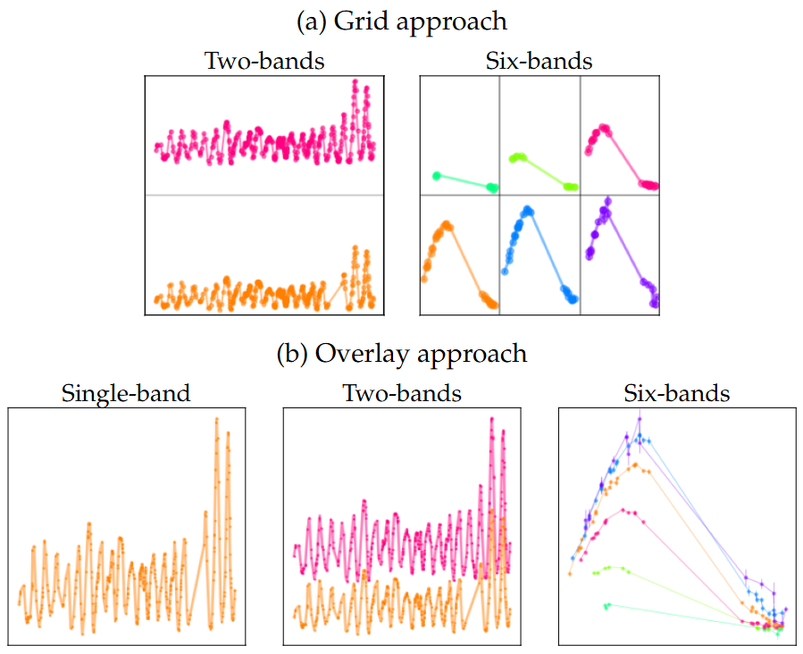
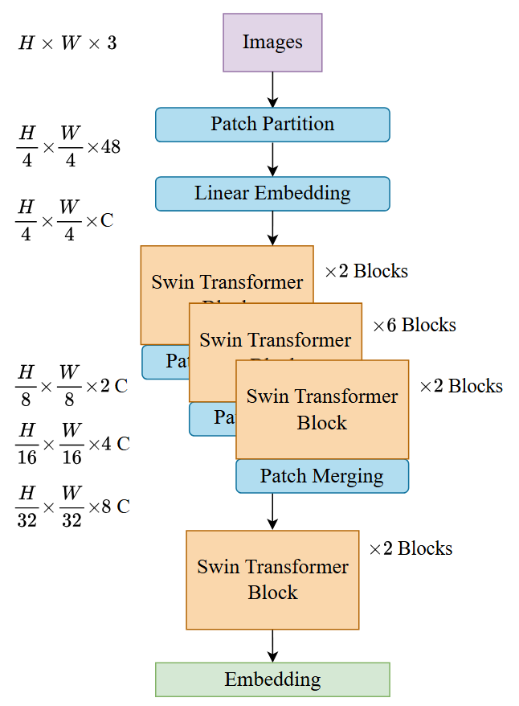

# Visual Transformer for Light Curve Classification

This repository contains the implementation of a Vision Transformer (VT) model called SwinV2, for classifying astronomical light curves. The model is designed to dynamically generate images from astronomical time series data during training, allowing flexibility in modifying hyperparameters without storing images on disk.

<p align="center">
  
  
</p>

## Getting Started

### **Clone the Repository**

To begin, clone this repository to your local machine:

```bash
git clone https://github.com/dnlmoreno/VT_Model_for_LightCurves_Classification.git
cd VT_Model_for_LightCurves_Classification
```

### **Set Up the Environment**

A Docker environment is provided to ensure reproducibility. Follow these steps to set up and run the container:

### Run the Docker Container

1. **Build the Docker image:**

   ```bash
   docker build -t visualtrans .
   ```

2. **Run the container with GPU support:**

   For Windows:
   ```bash
   docker run --gpus all -it --rm -v ${PWD}:/app -p 6006:6006 visualtrans
   ```

   For Linux:
   ```bash
   docker run --gpus all -it --rm -v $(pwd):/app -p 6006:6006 visualtrans
   ```

### Alternative: Using Conda

You can also set up the environment using Conda and install the required dependencies. However, we recommend using Docker to avoid compatibility issues across different machines.

```bash
conda create -n visualtrans python=3.10.9
conda activate visualtrans
pip install -r requirements.txt
```

### **Download the Data**

Download the required datasets using the provided script:

```bash
bash download_data.sh elasticc_1
bash download_data.sh macho
```

The downloaded data includes raw files and Parquet files containing partitions (training, validation, and test) with IDs corresponding to Astromer and ATAT. When you run the script to train the model, the raw files and partition.parquet are loaded directly into memory in `src/data/CustomDataset.py`, and any necessary adjustments or considerations are handled in `src/data/processing/get_data.py`. During training, images are generated dynamically, allowing hyperparameters to be adjusted on the fly without requiring new image versions to be stored on disk.

## Running the Model

### **Training with Best Hyperparameters**

The scripts for running the model with the best hyperparameters can be found in `scripts/run_best_hp/wo_slurm`. For example, to run the model with the best hyperparameters for multi-band MACHO using the Overlay approach and 500 samples per class, execute the following command:

```bash
bash scripts/run_best_hp/wo_slurm/run_macho_multiband_overlay_500.sh
```

We recommend reviewing these files, as they explain how to configure and use the hyperparameters. Note that the primary training script used within the execution scripts is `scripts/run_online.py`.

This command will create a `results/ml-runs` directory where all experiments will be logged using MLflow. See the section below for tracking experiments.

### **Core Training Script**

If you want to run `run_online.py` directly, you can do so using:

```
CUDA_VISIBLE_DEVICES=0 python -m scripts.run_online
```

It will use the default hyperparameter configuration from `configs/online/run_config.yaml`.


### **Configuration Files**

We use **Hydra** for flexible hyperparameter management. The main configuration files are:

- Model configuration: `configs/online/run_config.yaml`
- Dataset configuration: `configs/datasets_config.yaml`

For example, you can modify hyperparameters by passing them as arguments using the following structure:

```
python -m scripts.run_online ft_classification.loader.name_dataset='macho_multiband' ft_classification.loader.spc=500 ft_classification.imgs_params.input_type='2grid'
```

### **Hyperparameter Search**

The scripts for hyperparameter tuning are available for execution on a SLURM-based system. You can find them in `scripts/hp_tuning`.


## Tracking Experiments with MLflow

To monitor training runs using MLflow, start the UI with:

```bash
mlflow ui --backend-store-uri file:./results/ml-runs --host 0.0.0.0 --port 6006
```

and you can open in your navigator:

```bash
localhost:6006
```

Once training is complete, you can find the hyperparameters, model weights, evaluation metrics, and confusion matrices in the corresponding MLflow **artifacts** folder.

## Notebooks

The `notebooks` directory contains Jupyter notebooks used for extracting results from MLflow and generating visualizations for the paper. You can use these as references for analyzing and plotting results.

If you are using docker you should
```bash
jupyter notebook --ip=0.0.0.0 --port=6006 --allow-root
```

and you can open in your navigator:

```bash
localhost:6006
```

## Inference

Inference is performed at the end of the training script `run_online.py`. However, if for any reason you want to use a trained model for inference, you can update the main part of `scripts/predict_clf.py` with the appropriate values for the following variables:

* `exp_name`: *<mlflow_experiment_name>*
* `run_name`: <mlflow_run_name>
* `results_dir`: <directory containing results before the 'ml-flow' folder>
* `fold`: <fold_number>

Then, run the script with:

```bash
CUDA_VISIBLE_DEVICES=0 python -m scripts.predict_clf
```

---

For any issues or questions, feel free to open an issue in this repository. 🚀